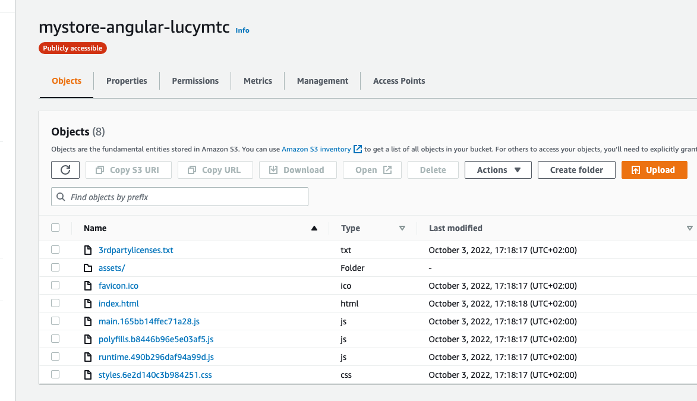

# Hosting a Full-Stack Application - From udacity projects

## My Store

This project is required by Udacity as part of the JS Fullstack nanodegree.
The repository contains mystore-api as well as mystore-fronend, both projects built on previous Udacity lessons and leveradged to be used in this hosting and autodeploying project.

URL http://mystore-angular-lucymtc.s3-website-us-east-1.amazonaws.com/

**Known issues** : API is currently not working on Elastic Beanstalk Environment.

---

### Dependencies and configuration.

- Node v16 (LTS) or more recent. While older versions can work it is advisable to keep node to latest LTS version
- npm 7 (LTS) or more recent
- AWS CLI v2
- RDS database running Postgres.
- S3 bucket

### Configuration screenshots

**MyStore APP front end S3 Bucket**

