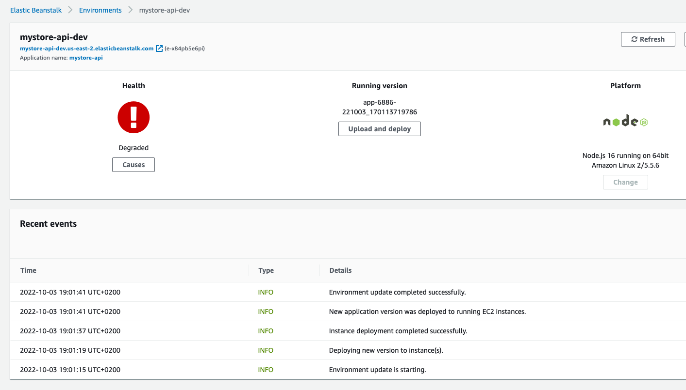

# Hosting a Full-Stack Application - From udacity projects

## My Store

This project is required by Udacity as part of the JS Fullstack nanodegree.
The repository contains mystore-api as well as mystore-fronend, both projects built on previous Udacity lessons and leveradged to be used in this hosting and autodeploying project.

URL http://mystore-angular-lucymtc.s3-website-us-east-1.amazonaws.com/

**Known issues** : API is currently not working on Elastic Beanstalk Environment.

---

### Documentation

- [Dependencies](documentation/Dependencies.md)
- [CircleCI Pipeline & Configuration](documentation/CircleCi.md)
- [AWS structure and Diagram](documentation/AWSServices.md)

### Project Configuration screenshots

**MyStore CircleCI**

**MyStore APP front end S3 Bucket**

**MyStore RDS database on Postgres**

**MyStore Elastic Beanstalk**
Known issue to be fixed, health degraded, cause: Impaired services on all instances.

