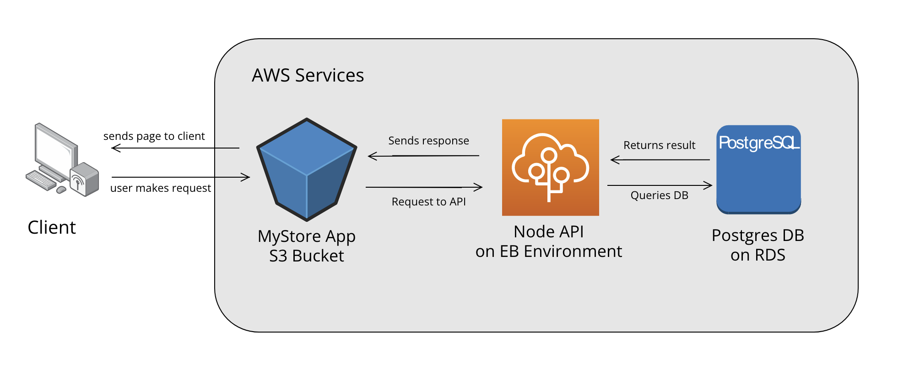

# Project Infrastructure with AWS Services

- S3 Bucket as a web hosting to host the Angular Front End App
- RDS PostgresSQL database.
- Elastic Beanstalk to run the back end API on a node server.

### Application Diagram
- created with https://online.visual-paradigm.com/

