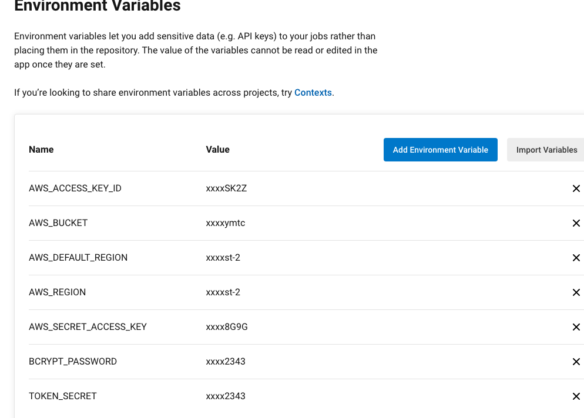

# CircleCI

### Pipeline Process
- Prepare environment by setting up Node & npm, AWS CLI, EB CLI.
- Install dependencies for FrontEnd app
- Install dependencies for Back End API
- Deploy Front End APP
- Deploy Back End API

### Enviroment variables configuration
